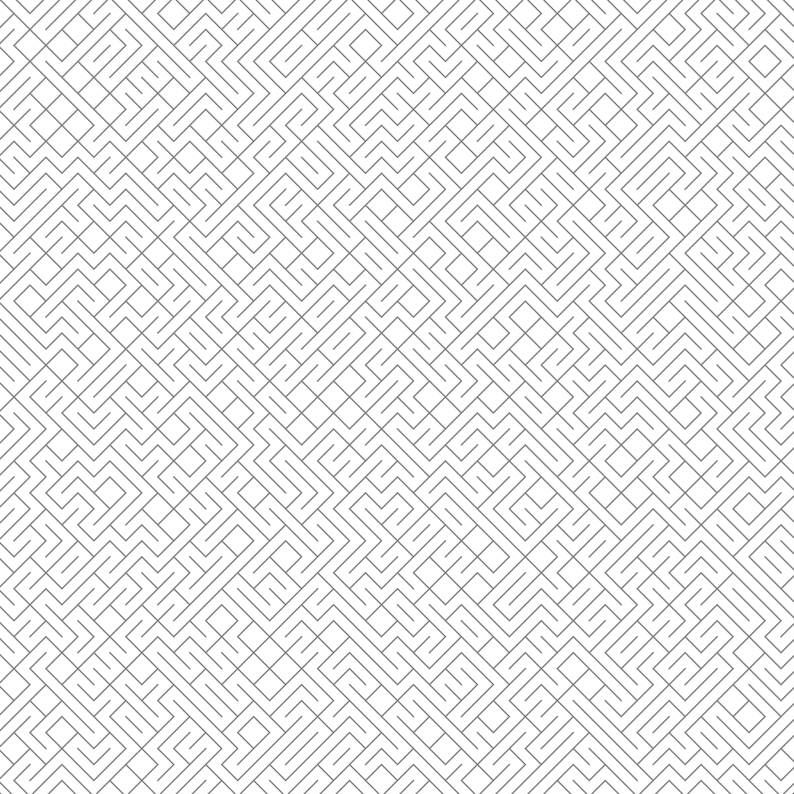
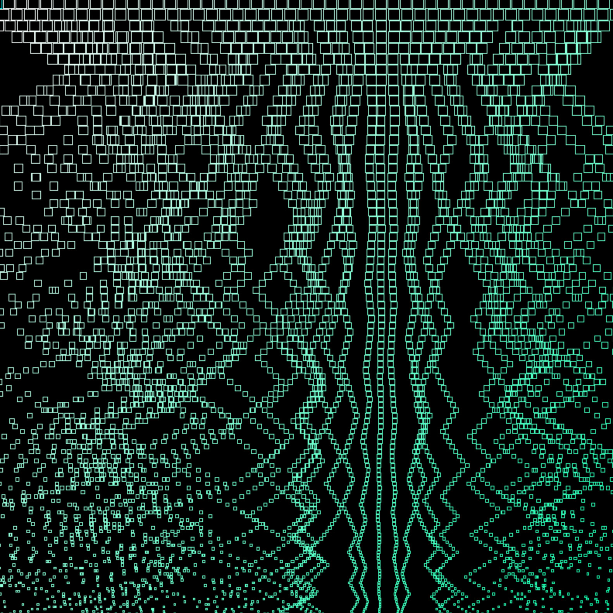
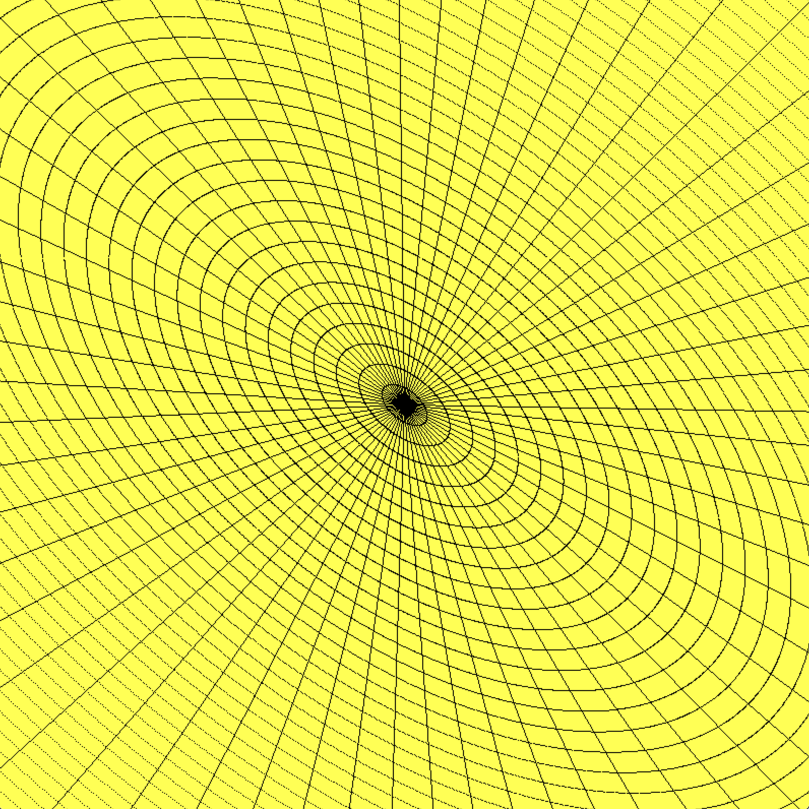
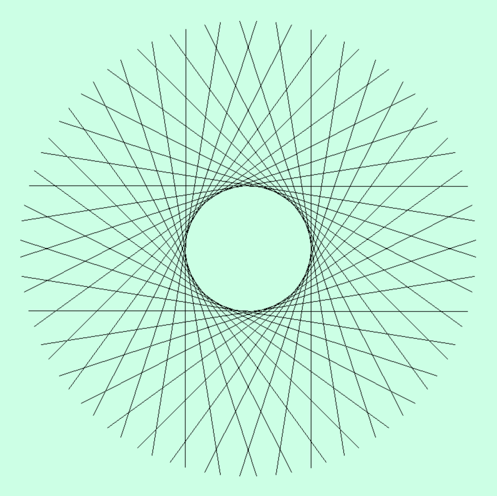
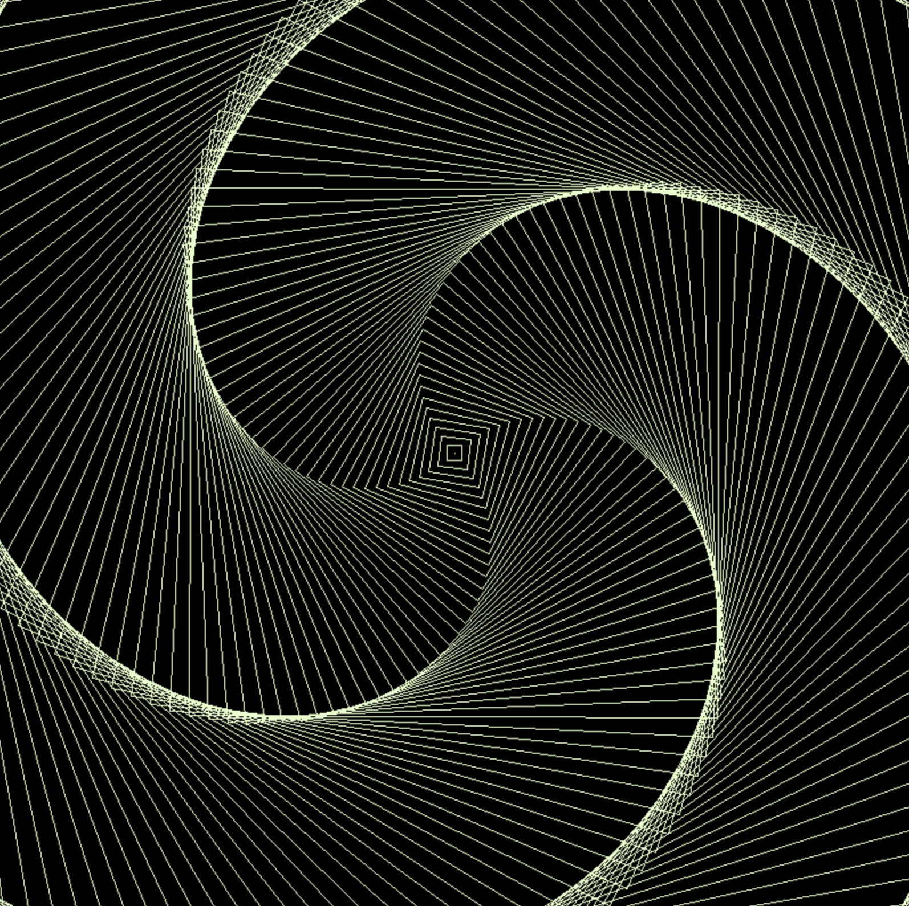

<h1 align="center">Artgen</h1>

<p align="center">My toy <a href="https://en.wikipedia.org/wiki/Generative_art">generative art</a> project written in C with the SDL library</p>

p align="center"><b>Read the blog post about this project <a href="https://carltheperson.com/posts/artgen/">here</a></b></p>

# Pieces

### `line_tiles`



### `static_dust`



### `poly_place`


### `circle_explosion`



### `not_a_circle`



### `square_rotations`



# Compiling

Linking the SDL_2 library can be a bit of a challenge. I recommend you find out yourself how to do that for your system. Here is what worked on my mac with `homebrew`:

```sh
brew install sdl2
```

```sh
gcc src/**/*.c  -I/opt/homebrew/include/SDL2 -D_THREAD_SAFE -L/opt/homebrew/lib -lSDL2 -o artgen
```

# Running

```sh
./artgen piece_id
```

E.g.

```sh
./artgen square_rotations
```

# License

This project is licensed under the MIT License - see the [LICENSE](LICENSE) file for details.
